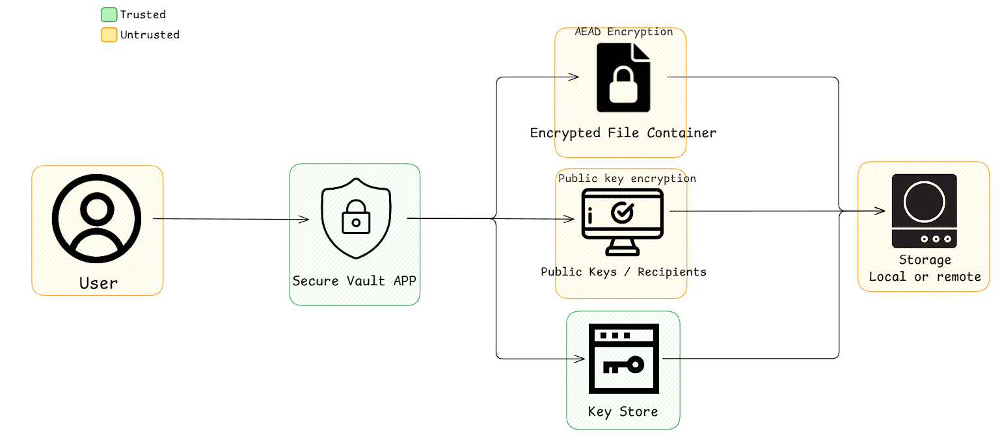

# Secure Digital Document Vault 

## Integrantes:  
- Salazar Serrano Edgar
- Mendoza González Mario
- Victoria Correa Laysha Daniela

## 1. Descripción General del Sistema

### 1.1 ¿Qué problema resuelve la bóveda?
La bóveda digital responde a la necesidad de proteger, compartir y verificar documentos digitales en entornos donde la confidencialidad, integridad y autenticidad son esenciales.

Actualmente, los documentos digitales pueden verse comprometidos por:
- Exposición de información sensible debido a almacenamiento inseguro.
- Manipulación o falsificación de archivos sin que el receptor lo detecte.
- Dificultades para compartir documentos cifrados con múltiples destinatarios.
- Gestión insegura de claves privadas y uso de contraseñas débiles.

El sistema aborda estos problemas mediante el uso correcto de primitivas criptográficas modernas, asegurando un manejo adecuado de nonces, cifrado autenticado, almacenamiento seguro de claves y verificación de integridad.

### 1.2 Funciones principales
El sistema combina primitivas criptográficas modernas con una arquitectura práctica basada en una aplicación de línea de comandos (CLI).

Sus funcionalidades principales son:
- **Cifrado autenticado (AEAD):** garantiza confidencialidad e integridad del documento.
- **Clave única por archivo:** cada documento se cifra con una clave simétrica distinta.
- **Cifrado híbrido:** las claves de archivo se protegen utilizando las llaves públicas de los destinatarios.
- **Firmas digitales:** los documentos se firman para garantizar autenticidad, la verificación ocurre antes del descifrado.
- **Gestión de claves privadas:** las claves privadas se protegen mediante funciones de derivación de contraseñas (KDF).
- **Compartición segura:** soporte para múltiples receptores.
- **Respaldo y recuperación:** mecanismo básico para recuperación de claves.

El ciclo de vida del documento dentro del sistema sigue el flujo: **Generación de clave → Cifrado → Encapsulamiento → Firma → Verificación**

### 1.3 ¿Qué está explícitamente fuera de alcance?
Basado en las advertencias de seguridad y los límites definidos en el proyecto, el sistema no incluye ni permite lo siguiente:

- **Gestión manual de claves:** no se permite que el usuario copie, envíe o gestione claves simétricas manualmente. La generación y manejo de claves debe ser automática dentro del sistema.
- **Uso de algoritmos obsoletos o débiles:** no se aceptan claves inseguras menores a 128 bits.
- **Uso de generadores pseudo-aleatorios no criptográficos:** no se pueden utilizar funciones como `Math.random()` u otros generadores no diseñados para seguridad. Es obligatorio usar un CSPRNG.
- **Almacenamiento de claves en texto plano:** las claves privadas no pueden guardarse sin protección en el disco. Deben estar cifradas y protegidas mediante contraseña y un KDF.
- **Reutilización de nonces:** reutilizar un nonce con la misma clave es un error grave que compromete la seguridad del sistema y está completamente prohibido.

---

## 2. Diagrama de Arquitectura  

---

## 3. Requerimientos de Seguridad  
- **Confidencialidad:** si un atacante obtiene acceso al contenedor de archivos, ya sea en almacenamiento local o remoto, no debe ser capaz de extaer ninguna informacion del contenido de los archivos sin tener una de las llaves privadas vinculadas al contenedor.  
- **Integridad de los archivos:** si se realiza alguna modificación de un arhivo del contenedor, debe ser detectada por el sistema. En caso de alteración se debe cancelar el proceso para evitar que se procesen datos corruptos.  
- **Autenticidad del remitente del archivo:** el destinatario debe tener la certeza de que el archivo fue generado por el dueño de la llave pública. Así un atacante no debe ser capaz de falsificar un archivo que aparentemente proviene de un usuario autorizado.
- **Confidencialidad de las llaves privadas:** las llaves privadas guardadas en el Key Store no deben estar accesibles en texto plano, deben estar protegidas con un cifrado derivado de la contraseña del usuario, de modo que si un atacante se roba el archivo, no pueda realizar ataques de fuerza bruta.
- **Protección contra manipulación (Metadatos y Cabeceras):** la protección del sistema debe ir más allá de los datos del archivo. No basta con cifrar el documento, el sistema también debe proteger la información que explica cómo descifrarlo. Así un atacante no debe ser capaz de cambiar los nombres de los destinatarios, ni intercambiar las llaves cifradas por otras, sin que el sistema lo detecte.
- **No repudio:** una vez que un archivo ha sido firmado y compartido, el emisor no podrá negar haber creado dicho contenido, puesto que la firma digital es única y está ligada exclusivamente a su llave privada.

---

## 4. Modelo de Amenaza
El modelo de amenaza define qué activos deben protegerse, contra qué tipo de adversarios se diseña el sistema y cuáles son las capacidades asumidas de los atacantes.

### 4.1 Activos
Los activos son los elementos del sistema que deben protegerse para garantizar su seguridad.

- **Contenido del archivo:** el documento original que el usuario cifra y comparte. Debe mantenerse confidencial y no ser accesible a personas no autorizadas.
- **Metadatos del archivo:** información asociada al documento, como identificadores, destinatarios o información de encapsulamiento. No deben poder modificarse sin ser detectados.
- **Claves privadas:** utilizadas para firmar documentos y descifrar claves de archivo. Son uno de los activos más críticos del sistema.
- **Contraseñas:** protegen las claves privadas mediante un KDF. Si se comprometen, también se compromete la clave privada.
- **Validez de la firma:** garantiza que el documento proviene del emisor legítimo y que no ha sido modificado.

### 4.2 Adversarios
El sistema está diseñado para defenderse contra los siguientes tipos de atacantes:

#### 4.2.1 Atacante externo con acceso a contenedores almacenados
Puede obtener acceso a archivos cifrados almacenados en disco o compartidos por otros medios.

**Puede hacer:**
- Copiar contenedores cifrados.
- Intentar modificar archivos o metadatos.
- Intentar ataques de fuerza bruta contra contraseñas débiles.

**No puede hacer:**
- Romper algoritmos criptográficos correctamente implementados.
- Descifrar archivos sin la clave correspondiente.
- Generar firmas válidas sin la clave privada legítima.

#### 4.2.2 Destinatario malicioso
Es un usuario legítimo que recibe un archivo pero intenta abusar del sistema.

**Puede hacer:**
- Intentar compartir el archivo con terceros.
- Intentar analizar el contenedor cifrado.
- Intentar modificar metadatos antes de reenviarlo.

**No puede hacer:**
- Acceder a documentos para los cuales no fue autorizado.
- Falsificar la firma del emisor.
- Descifrar claves destinadas a otros receptores.

#### 4.2.3 Atacante que modifica metadatos
Intenta alterar información asociada al documento para cambiar destinatarios o condiciones de acceso.

**Puede hacer:**
- Modificar partes del contenedor cifrado.
- Alterar campos visibles si no están protegidos.

**No puede hacer:**
- Alterar metadatos protegidos por AEAD sin que el sistema lo detecte.
- Hacer que un documento modificado pase la verificación de firma.

#### 4.2.4 Atacante con acceso temporal al dispositivo
Puede tener acceso físico o lógico temporal al equipo del usuario.

**Puede hacer:**
- Copiar archivos almacenados.
- Intentar extraer claves privadas del disco.
- Intentar ataques offline contra contraseñas.

**No puede hacer:**
- Utilizar la clave privada sin conocer la contraseña.
- Recuperar claves protegidas por un KDF fuerte.
- Descifrar documentos sin la clave correspondiente.

---
