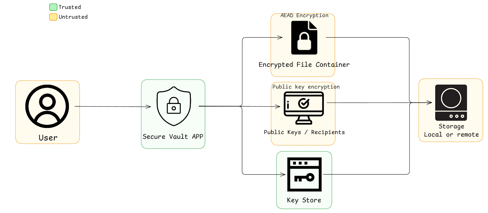

# Secure Digital Document Vault 

## Integrantes:  
- Salazar Serrano Edgar
- Mendoza González Mario
- Victoria Correa Laysha Daniela
- Rojas Jiménez Claudia Alin

## 1. Descripción General del Sistema

### 1.1 ¿Qué problema resuelve la bóveda?
La bóveda digital responde a la necesidad de proteger, compartir y verificar documentos digitales en entornos donde la confidencialidad, integridad y autenticidad son esenciales.

Actualmente, los documentos digitales pueden verse comprometidos por:
- Exposición de información sensible debido a almacenamiento inseguro.
- Manipulación o falsificación de archivos sin que el receptor lo detecte.
- Dificultades para compartir documentos cifrados con múltiples destinatarios.
- Gestión insegura de claves privadas y uso de contraseñas débiles.

El sistema aborda estos problemas mediante el uso correcto de primitivas criptográficas modernas, asegurando un manejo adecuado de nonces, cifrado autenticado, almacenamiento seguro de claves y verificación de integridad.

### 1.2 Funciones principales
El sistema combina primitivas criptográficas modernas con una arquitectura práctica basada en una aplicación de línea de comandos (CLI).

Sus funcionalidades principales son:
- **Cifrado autenticado (AEAD):** garantiza confidencialidad e integridad del documento.
- **Clave única por archivo:** cada documento se cifra con una clave simétrica distinta.
- **Cifrado híbrido:** las claves de archivo se protegen utilizando las llaves públicas de los destinatarios.
- **Firmas digitales:** los documentos se firman para garantizar autenticidad, la verificación ocurre antes del descifrado.
- **Gestión de claves privadas:** las claves privadas se protegen mediante funciones de derivación de contraseñas (KDF).
- **Compartición segura:** soporte para múltiples receptores.
- **Respaldo y recuperación:** mecanismo básico para recuperación de claves.

El ciclo de vida del documento dentro del sistema sigue el flujo: **Generación de clave → Cifrado → Encapsulamiento → Firma → Verificación**

### 1.3 ¿Qué está explícitamente fuera de alcance?
Basado en las advertencias de seguridad y los límites definidos en el proyecto, el sistema no incluye ni permite lo siguiente:

- **Gestión manual de claves:** no se permite que el usuario copie, envíe o gestione claves simétricas manualmente. La generación y manejo de claves debe ser automática dentro del sistema.
- **Uso de algoritmos obsoletos o débiles:** no se aceptan claves inseguras menores a 128 bits.
- **Uso de generadores pseudo-aleatorios no criptográficos:** no se pueden utilizar funciones como `Math.random()` u otros generadores no diseñados para seguridad. Es obligatorio usar un CSPRNG.
- **Almacenamiento de claves en texto plano:** las claves privadas no pueden guardarse sin protección en el disco. Deben estar cifradas y protegidas mediante contraseña y un KDF.
- **Reutilización de nonces:** reutilizar un nonce con la misma clave es un error grave que compromete la seguridad del sistema y está completamente prohibido.

---

## 2. Diagrama de Arquitectura  


---

## 3. Requerimientos de Seguridad  
- **Confidencialidad:** si un atacante obtiene acceso al contenedor de archivos, ya sea en almacenamiento local o remoto, no debe ser capaz de extaer ninguna informacion del contenido de los archivos sin tener una de las llaves privadas vinculadas al contenedor.  
- **Integridad de los archivos:** si se realiza alguna modificación de un arhivo del contenedor, debe ser detectada por el sistema. En caso de alteración se debe cancelar el proceso para evitar que se procesen datos corruptos.  
- **Autenticidad del remitente del archivo:** el destinatario debe tener la certeza de que el archivo fue generado por el dueño de la llave pública. Así un atacante no debe ser capaz de falsificar un archivo que aparentemente proviene de un usuario autorizado.
- **Confidencialidad de las llaves privadas:** las llaves privadas guardadas en el Key Store no deben estar accesibles en texto plano, deben estar protegidas con un cifrado derivado de la contraseña del usuario, de modo que si un atacante se roba el archivo, no pueda realizar ataques de fuerza bruta.
- **Protección contra manipulación (Metadatos y Cabeceras):** la protección del sistema debe ir más allá de los datos del archivo. No basta con cifrar el documento, el sistema también debe proteger la información que explica cómo descifrarlo. Así un atacante no debe ser capaz de cambiar los nombres de los destinatarios, ni intercambiar las llaves cifradas por otras, sin que el sistema lo detecte.
- **No repudio:** una vez que un archivo ha sido firmado y compartido, el emisor no podrá negar haber creado dicho contenido, puesto que la firma digital es única y está ligada exclusivamente a su llave privada.

---

## 4. Modelo de Amenaza
El modelo de amenaza define qué activos deben protegerse, contra qué tipo de adversarios se diseña el sistema y cuáles son las capacidades asumidas de los atacantes.

### 4.1 Activos
Los activos son los elementos del sistema que deben protegerse para garantizar su seguridad.

- **Contenido del archivo:** el documento original que el usuario cifra y comparte. Debe mantenerse confidencial y no ser accesible a personas no autorizadas.
- **Metadatos del archivo:** información asociada al documento, como identificadores, destinatarios o información de encapsulamiento. No deben poder modificarse sin ser detectados.
- **Claves privadas:** utilizadas para firmar documentos y descifrar claves de archivo. Son uno de los activos más críticos del sistema.
- **Contraseñas:** protegen las claves privadas mediante un KDF. Si se comprometen, también se compromete la clave privada.
- **Validez de la firma:** garantiza que el documento proviene del emisor legítimo y que no ha sido modificado.

### 4.2 Adversarios
El sistema está diseñado para defenderse contra los siguientes tipos de atacantes:

#### 4.2.1 Atacante externo con acceso a contenedores almacenados
Puede obtener acceso a archivos cifrados almacenados en disco o compartidos por otros medios.

**Puede hacer:**
- Copiar contenedores cifrados.
- Intentar modificar archivos o metadatos.
- Intentar ataques de fuerza bruta contra contraseñas débiles.

**No puede hacer:**
- Romper algoritmos criptográficos correctamente implementados.
- Descifrar archivos sin la clave correspondiente.
- Generar firmas válidas sin la clave privada legítima.

#### 4.2.2 Destinatario malicioso
Es un usuario legítimo que recibe un archivo pero intenta abusar del sistema.

**Puede hacer:**
- Intentar compartir el archivo con terceros.
- Intentar analizar el contenedor cifrado.
- Intentar modificar metadatos antes de reenviarlo.

**No puede hacer:**
- Acceder a documentos para los cuales no fue autorizado.
- Falsificar la firma del emisor.
- Descifrar claves destinadas a otros receptores.

#### 4.2.3 Atacante que modifica metadatos
Intenta alterar información asociada al documento para cambiar destinatarios o condiciones de acceso.

**Puede hacer:**
- Modificar partes del contenedor cifrado.
- Alterar campos visibles si no están protegidos.

**No puede hacer:**
- Alterar metadatos protegidos por AEAD sin que el sistema lo detecte.
- Hacer que un documento modificado pase la verificación de firma.

#### 4.2.4 Atacante con acceso temporal al dispositivo
Puede tener acceso físico o lógico temporal al equipo del usuario.

**Puede hacer:**
- Copiar archivos almacenados.
- Intentar extraer claves privadas del disco.
- Intentar ataques offline contra contraseñas.

**No puede hacer:**
- Utilizar la clave privada sin conocer la contraseña.
- Recuperar claves protegidas por un KDF fuerte.
- Descifrar documentos sin la clave correspondiente.

---
## 5. Suposiciones de confianza  
En criptografía, ningún sistema es seguro por sí mismo si el entorno en el que opera está corrompido. Las suposiciones de confianza definen qué condiciones externas deben cumplirse para que nuestras garantías de seguridad sean válidas.
Nuestro sistema asume que:  
- El o los dispositivos en donde se ejecuta la aplicación no se encuentran comprometidos por ningun malware, asi las contraseñas y llaves del usuario se encuentran seguras.
- Se tiene un generador de números aleatorios seguro.
- Solo el dueño de la llave publica puede abrir el archivo.
- Se asume que el usuario se hace responsable de elegir una contraseña con suficiente entropia y de que no la compartirá.
- El almacenamiento pueder ser comprometido dando acceso a algun atacante ya sea en el servidor local o en la nube.
- Se usarán algoritmos criptográficos estandarizados sin errores de implementación o puertas traseras.

---

## 6. Análisis de la superficie de ataque. 
Este análisis es un paso crítico para identificar todas las interfaces donde un adversario podría intentar subvertir los controles criptográgicos del sistema. En una herramienta de CLI como nuestra Secure Digital Document Vault, la seguridad no depende solo de la robustez de los algoritmos (como AES o EdDSA), sino de cómo el software maneja la entrada de datos externos y la interacción con el sistema operativo. 

| Punto de Entrada | ¿Qué podría salir mal? | Propiedad en Riesgo |
| :--- | :--- | :--- |
| **Entrada de archivos** | Procesamiento de archivos malformados o excesivamente grandes para causar un DoS. | **Disponibilidad** |
| **Análisis de metadatos** | Inyección de información falsa o manipulación de cabeceras para engañar al sistema. | **Integridad / Autenticidad** |
| **Importación/Exportación de llaves** | Almacenamiento de llaves privadas en texto plano o con cifrado débil en el disco. | **Confidencialidad** |
| **Entrada de contraseña** | Ataques de fuerza bruta o exposición de la contraseña en el historial de la terminal. | **Confidencialidad** |
| **Flujo de compartición** | Inclusión accidental de llaves públicas no autorizadas, dando acceso a terceros. | **Confidencialidad** |
| **Verificación de firmas** | Procesar o descifrar datos antes de validar que la firma digital sea legítima. | **Autenticidad / Integridad** |
| **Argumentos de CLI** | Datos sensibles quedando registrados en el historial de comandos del sistema operativo. | **Confidencialidad** |

---

## 7. Restricciones de Diseño Derivadas de los Requisitos

Para asegurar un diseño intencional, cada requerimiento se traduce en una decisión técnica obligatoria.

| Requerimiento | Restricción de Diseño |
| :--- | :--- |
| **Integridad garantizada** | Es obligatorio el uso de **AEAD** (como AES-GCM o ChaCha20-Poly1305). |
| **Autenticidad requerida** | Se deben implementar **Firmas Digitales** (ej. Ed25519) para validar al emisor. |
| **Protección de llaves privadas** | Las llaves deben cifrarse con un **KDF** robusto (ej. Argon2id) antes de ir a disco. |
| **Confidencialidad en almacenamiento** | Implementación de **Cifrado Híbrido** para manejar múltiples destinatarios. |
| **Prevención de reutilización de llaves** | Uso obligatorio de un **CSPRNG** para generar llaves y nonces únicos por archivo. |

### Conclusión de Diseño
Al mapear estas restricciones, el sistema se vuelve resistente no solo a ataques externos, sino también a errores comunes de implementación. La arquitectura garantiza que, incluso si el almacenamiento es comprometido, la información permanezca cifrada y auténtica.

---

## 8. Arquitectura de Cifrado Híbrido (ECIES + AES-GCM)

Para cumplir con la necesidad de compartir archivos de forma segura con múltiples destinatarios, el sistema fue ampliado implementando un esquema de cifrado híbrido usando la librería `cryptography` de Python.

### 8.1 Explicación del Diseño Híbrido
* **¿Por qué se utiliza el cifrado híbrido?**
    Combina la eficiencia computacional del cifrado simétrico con la seguridad y conveniencia de distribución de claves del cifrado asimétrico. Permite cifrar un documento pesado una sola vez y autorizar a varios usuarios sin duplicar el archivo original para cada uno.
* **¿Por qué sigue siendo necesario el cifrado simétrico?**
    El cifrado de clave pública (asimétrico) es costoso a nivel de procesamiento y no está diseñado matemáticamente para cifrar grandes volúmenes de datos. **AES-256-GCM** cifra el contenido real del archivo porque es rápido, maneja bloques grandes y provee validación de integridad.
* **¿Por qué es necesario el cifrado de claves por destinatario?**
    Para eliminar la necesidad de compartir una "contraseña maestra". Se genera una clave simétrica única aleatoria para el archivo, y esta pequeña clave se cifra individualmente con la clave pública de cada destinatario (ECIES). Así, cada usuario utiliza su propia clave privada para recuperar el acceso.

### 8.2 Decisiones de Seguridad
* **¿Cómo identifican los destinatarios su llave?**
    El sistema utiliza **identificadores de usuario explícitos**. El archivo `.vault` guarda un arreglo donde cada entrada empareja un `id` en texto plano (ej. "alice") con la clave cifrada específicamente para ese usuario.
* **¿Qué ocurre si el atacante modifica la lista de destinatarios?**
    El descifrado falla al instante. La lista completa de identificadores (junto a los metadatos) se inyecta en el **AAD (Additional Authenticated Data)** de AES-GCM. Si un atacante altera o elimina un destinatario, la validación de la etiqueta de autenticación (Tag) fracasa y el programa bloquea el acceso.
* **¿Qué ocurre si la clave pública es incorrecta (o se usa una privada equivocada)?**
    El descifrado falla durante la capa ECIES. En el intercambio de claves (ECDH), el secreto derivado será matemáticamente incorrecto, la función de derivación (HKDF) generará una clave AES equivocada, y el MAC interno rechazará la operación antes de siquiera intentar procesar el archivo principal.
* **¿Qué ocurre si la clave pública es incorrecta (o se usa una privada equivocada)?**
    El descifrado falla durante la capa ECIES. En el intercambio de claves (ECDH), el secreto derivado será matemáticamente incorrecto, la función de derivación (HKDF) generará una clave AES equivocada, y el MAC interno rechazará la operación antes de siquiera intentar procesar el archivo principal.


---

## 9. Estructura del Código Criptográfico

La estructura del proyecto separa claramente los scripts del usuario de la lógica criptográfica (`src/`).

```text
vault_container/
├── encrypted_vault/      # Almacena los archivos .vault cifrados
├── decrypted_files/      # Guarda los archivos descifrados
├── plaintext/            # Contiene los archivos originales a cifrar
├── user_keys/            # Almacena las claves públicas y privadas de los usuarios
│
├── encrypt_file.py       # Cifra un archivo para uno o más destinatarios.
├── decrypt_file.py       # Descifra un vault si eres un destinatario.
├── share_vault.py        # Añade nuevos destinatarios a un vault existente.
├── generate_user_keys.py # Crea pares de claves ECC para los usuarios.
├── test_security.py      # Ejecuta las pruebas unitarias automatizadas.
│
└── src/crypto_vault/
    ├── vault.py          # Lógica principal de cifrado/descifrado híbrido.
    ├── key_manager.py    # Gestión y derivación de claves.
    └── container.py      # Empaquetado en JSON y Base64.
```

### Diagrama del Flujo de Cifrado Híbrido (ASCII Art)

```
                +-----------------+      +----------------------+      +----------------------+
Archivo ---->   | Cifrado AES-GCM | ---> |   Contenido Cifrado  |      |   Contenido Cifrado  |
Original        +-----------------+      +----------------------+      |                      |
                      ^                                                |                      |
                      |                                                |   +----------------+ |
                +-----+------+           +-------------------------+   |   |   Tag (GMAC)   | |
                | Clave de   | --------> | Cifrado ECIES (por c/u) | --+-> | +----------------+ |
                | Archivo    |           +-------------------------+   |   | Lista de         | |
                | (Simétrica)|                 ^         ^         ^   |   | Destinatarios:   | |
                +------------+                 |         |         |   |   | +--------------+ | |
                                               |         |         |   |   | | Alice: Key_A | | |
                       +-----------------------+         |         |   |   | +--------------+ | |
                       |                                 |         |   |   | | Bob:   Key_B | | |
            +----------+----------+           +----------+-------+ |   |   | +--------------+ | |
            | Clave Pública Alice |           | Clave Pública Bob| ... |   | | ...          | | |
            +---------------------+           +--------------------+   |   +----------------+ |
                                                                       +----------------------+
                                                                            Archivo .vault
```

---

## 10. Manual de Uso (Flujo CLI)

Todo el flujo operativo se maneja a través de la terminal mediante los scripts de la raíz del proyecto.

**Paso 1: Generar Claves para los Usuarios**
```bash
python generate_user_keys.py
```
*(Solicitará un ID de usuario y una contraseña local para proteger la clave privada generada).*

**Paso 2: Cifrar un Archivo (Crear Vault)**
```bash
python encrypt_file.py
```
*(Solicitará la ruta del archivo plano y entrará en un bucle para agregar el ID y la ruta de la clave pública de cada destinatario autorizado).*

**Paso 3: Añadir un Nuevo Usuario a un Vault Existente**
```bash
python share_vault.py
```
*(Para poder compartir un documento, el usuario actual debe autenticarse ingresando su propia ID, llave privada y contraseña para desenvolver temporalmente la clave de archivo. Luego podrá añadir el ID y la llave pública del nuevo destinatario. El sistema re-cifrará el AAD automáticamente).*

**Paso 4: Descifrar un Documento**
```bash
python decrypt_file.py
```
*(Solicitará elegir el archivo `.vault` a descifrar, el ID del usuario, y su llave privada. Si las validaciones de AAD y ECIES son correctas, el archivo original aparecerá en la carpeta `decrypted_files/`).*

---

## 11. Pruebas Unitarias de Seguridad 🧪

Para asegurar el cumplimiento empírico de las políticas de acceso y la resistencia contra modificaciones, el proyecto incluye la suite de validación `test_security.py` construida sobre la librería `unittest`. 

Esta suite ejecuta pruebas en memoria sin afectar los archivos locales, validando las siguientes afirmaciones establecidas en los requisitos:

1. **Múltiples Destinatarios:** Si el archivo se comparte con dos o más usuarios, el sistema permite que ambos lo descifren de forma independiente usando sus respectivas claves privadas.
2. **Rechazo a No Autorizados:** Un usuario que no está en la lista de destinatarios es inmediatamente bloqueado e incapaz de descifrar el contenido.
3. **Protección de AAD contra Manipulación:** Si un atacante altera la estructura JSON o añade un usuario a la lista de destinatarios en el archivo `.vault`, el Tag GCM no coincidirá y el descifrado fallará.
4. **Validación de Claves Correctas:** Si se introduce una clave privada incorrecta (incluso utilizando un ID válido), el proceso de derivación ECDH falla de manera segura y deniega el acceso.
5. **Revocación Efectiva:** Eliminar la entrada de un destinatario del archivo rompe su acceso permanentemente, logrando una correcta denegación de servicios a nivel de usuario.

**Comando para ejecutar las pruebas:**
```bash
python test_security.py
```
