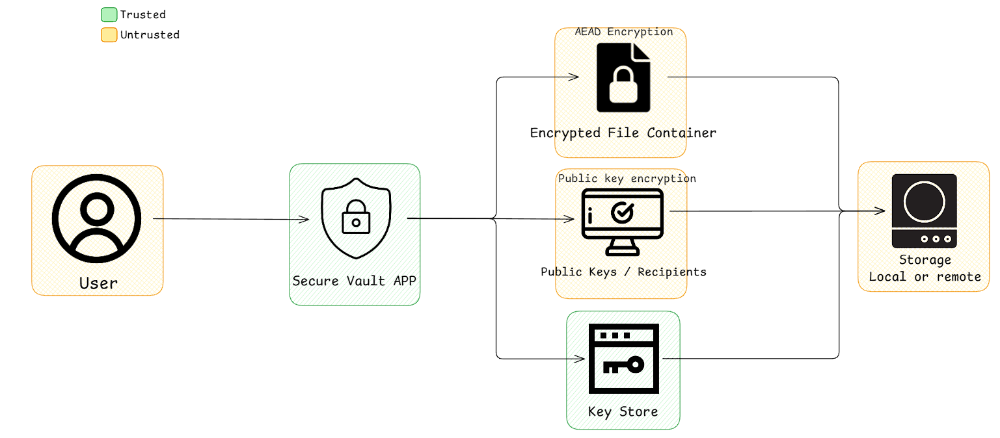

# Secure Digital Document Vault 

## Integrantes:  
- Salazar Serrano Edgar
- Mendoza González Mario
- Victoria Correa Laysha Daniela
- Rojas Jiménez Claudia Alin

## 1. Descripción General del Sistema

### 1.1 ¿Qué problema resuelve la bóveda?
La bóveda digital responde a la necesidad de proteger, compartir y verificar documentos digitales en entornos donde la confidencialidad, integridad y autenticidad son esenciales.

Actualmente, los documentos digitales pueden verse comprometidos por:
- Exposición de información sensible debido a almacenamiento inseguro.
- Manipulación o falsificación de archivos sin que el receptor lo detecte.
- Dificultades para compartir documentos cifrados con múltiples destinatarios.
- Gestión insegura de claves privadas y uso de contraseñas débiles.

El sistema aborda estos problemas mediante el uso correcto de primitivas criptográficas modernas, asegurando un manejo adecuado de nonces, cifrado autenticado, almacenamiento seguro de claves mediante un **Keystore con Argon2id**, firmas digitales Ed25519 y verificación de integridad estricta.

### 1.2 Funciones principales
El sistema combina primitivas criptográficas modernas con una arquitectura práctica basada en una aplicación de línea de comandos (CLI).

Sus funcionalidades principales son:
- **Cifrado autenticado (AEAD):** garantiza confidencialidad e integridad del documento usando AES-256-GCM.
- **Clave única por archivo:** cada documento se cifra con una clave simétrica distinta.
- **Cifrado híbrido:** las claves de archivo se protegen utilizando ECIES sobre las llaves públicas de los destinatarios (curva SECP384R1).
- **Firmas digitales:** los documentos se firman con **Ed25519** bajo el paradigma **Encrypt-then-Sign** para garantizar autenticidad y atadura de contexto. La verificación ocurre de manera **fail-fast** antes de cualquier intento de descifrado.
- **Gestión de claves privadas:** las claves privadas se protegen localmente mediante la función derivadora **Argon2id** y AES-GCM dentro de un directorio Keystore.
- **Compartición segura:** soporte para añadir múltiples receptores actualizando y re-firmando el contenedor.
- **Canonicalización estricta:** el AAD y la firma se calculan ordenando las llaves JSON de manera determinista y usando UTF-8.

El ciclo de vida del documento dentro del sistema sigue el flujo: **Generación de claves → Cifrado (AES-GCM + ECIES) → Encapsulamiento → Firma (Ed25519) → Verificación (Fail-fast) → Descifrado**

### 1.3 ¿Qué está explícitamente fuera de alcance?
Basado en las advertencias de seguridad y los límites definidos en el proyecto, el sistema prohíbe:

- **Gestión manual de claves:** no se permite que el usuario copie, envíe o gestione claves simétricas manualmente. La generación y el intercambio de claves se manejan automáticamente por la lógica del sistema.
- **Uso de algoritmos obsoletos o débiles:** no se aceptan claves menores a 128 bits de nivel de seguridad.
- **Uso de generadores pseudo-aleatorios no criptográficos:** es obligatorio el uso de un CSPRNG (e.g. `os.urandom`).
- **Almacenamiento de claves en texto plano:** las claves privadas nunca pueden guardarse sin protección en el disco. Deben residir en el Keystore cifradas por el KDF.
- **Reutilización de nonces:** reutilizar un nonce es un error catastrófico que rompe GCM, lo cual está bloqueado estructuralmente.

---

## 2. Diagrama de Arquitectura  


*(Nota: El diagrama ilustra la arquitectura general del sistema base; para los detalles completos del esquema de cifrado y firmado, consultar la sección de Arquitectura Criptográfica).*

---

## 3. Requerimientos de Seguridad  
- **Confidencialidad:** si un atacante obtiene acceso al contenedor de archivos, no debe ser capaz de extraer información del contenido sin poseer la llave privada autorizada.  
- **Integridad de los archivos:** cualquier modificación a un archivo del contenedor (sea el documento cifrado, metadatos, nonce o la lista de receptores) será detectada invariablemente.  
- **Autenticidad del remitente:** el destinatario tiene la certeza criptográfica de que el archivo fue generado por el dueño de la llave pública mediante la validación de la firma digital.
- **Confidencialidad de las llaves privadas:** las llaves guardadas en el Keystore están protegidas contra ataques de fuerza bruta usando un cifrado derivado de la contraseña del usuario (Argon2id).
- **Protección contra manipulación de Metadatos:** un atacante no puede alterar los identificadores de destinatarios, inyectar llaves públicas falsas, ni modificar el Nonce sin invalidar la firma y la etiqueta de autenticación (Tag) simultáneamente.
- **No repudio:** una vez firmado y compartido el archivo, el emisor no puede negar la autoría del contenido, pues la firma Ed25519 está ligada exclusivamente a su llave privada de firmado.

---

## 4. Modelo de Amenaza
Este modelo define qué activos deben protegerse y bajo qué escenarios asume que operan los atacantes.

### 4.1 Activos
- **Contenido del archivo:** el documento sensible original.
- **Metadatos del contenedor:** identificadores, nonce y tag GCM. Protegidos por la firma digital.
- **Claves privadas (ECC y Ed25519):** los elementos más críticos, protegidos en disco en todo momento.
- **Contraseñas del usuario:** la única línea de defensa de las claves en disco.
- **Validez de la firma:** componente principal para detectar la alteración del archivo, ligada íntimamente a los datos y metadatos.

### 4.2 Adversarios
#### 4.2.1 Atacante externo con acceso a contenedores almacenados
**Puede hacer:** Copiar bóvedas, intentar alterar información en bruto o atacar cifrados.
**No puede hacer:** Romper la curva elíptica P-384, falsificar la firma de Ed25519 o descifrar AES-GCM sin la clave ECIES y el secreto de derivación.

#### 4.2.2 Destinatario malicioso
**Puede hacer:** Compartir el texto plano tras descifrarlo en su propia terminal.
**No puede hacer:** Acceder a otras bóvedas para las que no está en la lista de receptores, falsificar la firma original del emisor, o re-cifrar el archivo alterado pasándolo por legítimo sin la llave de firma del emisor.

#### 4.2.3 Atacante que modifica metadatos
**Puede hacer:** Modificar los JSON en texto claro.
**No puede hacer:** Hacer que la aplicación acepte sus modificaciones. El sistema verificará la firma digital en fase Fail-Fast y abortará la operación si algún byte de la metadata (AAD), los recipientes o el nonce han sido manipulados.

#### 4.2.4 Atacante con acceso temporal al dispositivo
**Puede hacer:** Copiar la carpeta Keystore con las llaves privadas cifradas.
**No puede hacer:** Usar las llaves sin la contraseña de descifrado, o lanzar ataques offline masivos y baratos contra las contraseñas debido al costo asimétrico en memoria y tiempo impuesto por Argon2id.

---

## 5. Suposiciones de Confianza  
- Los dispositivos donde opera la CLI no están infectados con malware que intercepte el teclado o extraiga la memoria RAM.
- Existe y se utiliza un generador de números aleatorios criptográficamente seguro proveniente del sistema operativo.
- El usuario es responsable de usar contraseñas fuertes (entropía aceptable) y gestionar su seguridad física y lógica básica.
- Los algoritmos estándar usados de la librería OpenSSL/`cryptography` en Python carecen de puertas traseras.

---

## 6. Análisis de la Superficie de Ataque

| Punto de Entrada | ¿Qué podría salir mal? | Propiedad en Riesgo |
| :--- | :--- | :--- |
| **Entrada de archivos** | Procesamiento de archivos malformados para causar un DoS. | **Disponibilidad** |
| **Análisis de metadatos** | Inyección de información falsa para engañar al sistema. | **Integridad / Autenticidad** |
| **Keystore en Disco** | Robo del Keystore y fuerza bruta offline. | **Confidencialidad** |
| **Entrada de contraseña** | Exposición de la contraseña al escribirse o interceptarse. | **Confidencialidad** |
| **Flujo de compartición** | Inclusión accidental de llaves públicas no autorizadas. | **Confidencialidad** |
| **Verificación de firmas** | Descifrar y tratar los datos *antes* de validar que son auténticos. (Mitigado por paradigma fail-fast). | **Autenticidad / Integridad** |

---

## 7. Restricciones de Diseño Derivadas de los Requisitos

| Requerimiento | Restricción de Diseño Aplicada |
| :--- | :--- |
| **Integridad garantizada** | Obligatorio el uso del modo **AEAD (AES-256-GCM)** con AAD completo. |
| **Autenticidad estricta** | Uso de Firmas **Ed25519** (Encrypt-then-Sign) vinculando todo el contexto: AAD, Nonce, CT y Receptores. |
| **Protección robusta en disco** | Las llaves se almacenan en un Keystore envueltas por un **KDF de alto costo (Argon2id)**. |
| **Múltiples destinatarios** | Sistema **Híbrido ECIES** Derivación ECDH + HKDF para proteger la llave simétrica sin compartir un secreto central. |
| **Determinismo estructural** | Especificación de **Canonicalización** al serializar JSON y ordenar diccionarios para asegurar que las firmas y tags coincidan siempre bit a bit. |

---

## 8. Arquitectura de Cifrado Híbrido y Firmas

El sistema evolucionó de un esquema base a una bóveda robusta integrando tres esquemas matemáticos distintos:

### 8.1 Explicación del Diseño
* **¿Por qué AES-GCM y ECIES unidos?**
  AES-256-GCM se encarga de cifrar grandes volúmenes de manera rápida con protección de integridad. ECIES asegura esta pequeña llave AES-256 para cada uno de los receptores aprobados aprovechando sus llaves públicas SECP384R1, lo cual brinda alta flexibilidad de acceso.
* **Paradigma Encrypt-then-Sign con Ed25519**
  Un vector de ataque en sistemas híbridos es la modificación del archivo cifrado antes de entregarlo. En este sistema se cifra el archivo primero, y a continuación, el emisor genera una firma Ed25519 sobre todos los componentes: el `nonce`, el Ciphertext `CT`, el `Tag`, el AAD, y la **lista ordenada de destinatarios**. 
* **Fail-Fast Verification**
  Durante el descifrado, lo **primero** que ocurre es la comprobación matemática de la firma Ed25519 utilizando la llave pública del remitente. Si falla, el archivo fue manipulado y la ejecución aborta sin arriesgarse a inyectar información corrupta en AES o HKDF.

### 8.2 Diagrama del Flujo de Cifrado 

```text
               +---------------+
               | Archivo Plano |
               +-------+-------+
                       |
             (Clave AES-256 Aleatoria)
                       |
           +-----------v-----------+          
           |   AES-256-GCM (CT)    | -------> Ciphertext + Tag
           +-----------+-----------+
                       |
               (Para c/Receptor)
                       |
           +-----------v-----------+          +-------------------------+
           |     ECIES x Usuario   | -------> | Array Cifrado Receptores|
           +-----------+-----------+          +-------------------------+
                       |
          (AAD + Nonce + CT + Tag + Receptores)
                       |
           +-----------v-----------+          +-------------------------+
           | Firma Ed25519 (Emisor)| -------> |       Firma Digital     |
           +-----------------------+          +-------------------------+

              * Finalmente, todo se empaqueta en JSON serializado y Base64 (.vault)
```

---

## 9. Estructura del Código Criptográfico

La lógica del proyecto separa los puntos de contacto CLI (`vault_container/`) de la matemática fundamental (`src/`).

```text
Cryptography/
├── vault_container/
│   ├── encrypted_vault/         # Archivos .vault cifrados
│   ├── decrypted_files/         # Archivos descifrados tras validación
│   ├── plaintext/               # Archivos originales de prueba
│   ├── user_keys/               # Llaves públicas y directorios Keystore de usuarios
│   │
│   ├── encrypt_file.py          # Cifra un archivo y lo firma
│   ├── decrypt_file.py          # Verifica la firma y lo descifra si es válido
│   ├── share_vault.py           # Añade a nuevos receptores y re-firma
│   ├── generate_user_keys.py    # Crea pares ECC y Ed25519 (protegidos con Keystore)
│   │
│   ├── test_security.py         # Suite 1: Controles de acceso e integridad básicos
│   ├── test_vulnerabilidades.py # Suite 2: Auditoría y validación de parches
│   └── tests/
│       └── test_signatures.py   # Suite 3: Casos de uso avanzados de la Firma Digital
│
└── src/crypto_vault/
    ├── vault.py                 # Core criptográfico: AES, ECIES, Firmas y Verificación.
    ├── key_manager.py           # Generación de llaves, KDF (Argon2id) y Keystore local.
    └── container.py             # Funciones de serialización JSON/Base64.
```

---

## 10. Manual de Uso 

El sistema opera completamente desde scripts en Python, ejecutados idealmente dentro de la carpeta `vault_container/`.

## Requisitos Previos

Asegúrate de estar en el directorio raíz del proyecto:
```bash
cd /home/crypto/Cryptography/
```

Es recomendable activar tu entorno virtual si tienes uno configurado. Puedes instalar las dependencias manualmente usando `pip install -r requirements.txt` o ejecutar el script `setup_demo.py`.

**Paso 1: Generar Claves para los Usuarios**
```bash
python generate_user_keys.py
```
*(Solicita un ID y una contraseña. Genera un par ECC (SECP384R1) para descifrado y un par Ed25519 para firmas, creando un Keystore cifrado con Argon2id).*

**Paso 2: Cifrar un Archivo: Creación del Vault**
```bash
python encrypt_file.py
```
*(Pregunta por el archivo a cifrar y autentica al emisor usando su Keystore. Añade en bucle a cada receptor autorizado ingresando su llave pública. Finaliza generando el contenedor `.vault` firmado).*

**Paso 3: Añadir un Nuevo Usuario a un Vault Existente**
```bash
python share_vault.py
```
*(El propietario/remitente se autentica, extrae temporalmente la clave maestra en memoria, la cifra para el nuevo usuario ECIES, y reescribe el vault actualizando el AAD y re-generando la firma digital con todos los cambios).*

**Paso 4: Descifrar un Documento**
```bash
python decrypt_file.py
```
*(El receptor indica el archivo `.vault` e ingresa la llave pública del remitente para validar la firma. Si el vault es íntegro y auténtico, el Keystore local desbloquea ECIES y devuelve el archivo en plano a la carpeta `decrypted_files/`).*

---

## 11. Pruebas Unitarias y Auditoría 

El código fuente incluye 3 grupos de pruebas (UnitTests) rigurosas para certificar matemáticamente las políticas de diseño:

### 11.1 Suite Básica de Controles (`test_security.py`)
- Valida que usuarios no autorizados fracasen invariablemente en descifrar.
- Confirma que llaves incorrectas causen una denegación determinista por ECIES.
- Certifica que dos usuarios autorizados puedan desencapsular con completa independencia.

### 11.2 Suite de Firmas (`tests/test_signatures.py`)
- Asegura que cambiar un solo byte en el Ciphertext o Tag provoque que Ed25519 rechace el contenedor.
- Asegura que cualquier alteración al AAD revoque toda autenticación en paso fail-fast.
- Comprueba que la validación falla contundentemente si se aporta la llave pública equivocada.

### 11.3 Suite de Vulnerabilidades Post-Auditoría (`test_vulnerabilidades.py`)
Basado en hallazgos documentados de auditoría, se certificaron dos parches de arquitectura muy críticos:
- **Resistencia a Manipulación de Receptores:** Inyectar artificialmente la llave cifrada de un tercero "debajo" del cifrado es interceptado inmediatamente, porque la llave pública y el ID del receptor están firmados.
- **Inmutabilidad del Nonce:** Cambiar el nonce (aún si AES intentara procesarlo) es un vector cerrado porque la firma rechaza el contenedor primero.

**Para ejecutar los tests manualmente:**
```bash
python -m unittest test_security.py
python -m unittest tests/test_signatures.py
python -m unittest test_vulnerabilidades.py
```
